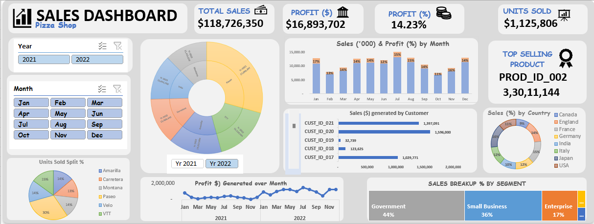

# 📊 Excel Sales Dashboard

## 📌 Project Overview
This is an interactive **Excel Sales Dashboard** created as part of my data analysis learning journey.  
It provides key insights into sales performance using **Pivot Tables, Pivot Charts, and Slicers**.

⚠️ Note:  
The dataset was taken from a YouTube tutorial for practice purposes.  
The dashboard design, implementation, and customization were done by me (DataXprtBD).

---

## ✨ Features
- Monthly Sales Analysis  
- Top 5 Products by Revenue  
- Region-wise and Category-wise Sales Performance  
- Interactive Filters with **Slicers** & **Timeline**  
- Dynamic **Pivot Charts** for visualization  

---

## 🛠️ Tools & Skills Used
- Microsoft Excel  
- Pivot Tables & Pivot Charts  
- Slicers & Timelines  
- Data Cleaning & Formatting  

---

## 📷 Dashboard Preview
*(Add a screenshot of your dashboard here once uploaded)*  
```markdown



